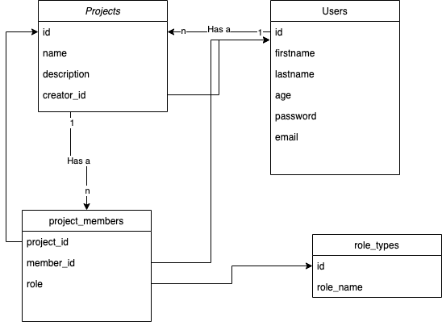

# Welcome to My Basecamp 1

Project created on ruby. It's primary features are to-do lists, milestone management, forum-like messaging, file sharing, and time tracking - basecamp

## Task
TODO - What is the problem? And where is the challenge?

## Description
We structured our project into few parts, such as:

    1. app
        1. controllers - Here I placed UserController,ProjectsController which responsible for routing
        2. models - User, Project Model which manipulate data from our database
        3. views - Here we have 2 directories, which contains projects and user views
    2. config
        1. database.yml (database yaml configuration)
        2. environment.rb (environment settings)
    3. database(db)
        1. migrate folder (for our database migrations)
        2. development.sqlite (our database)
        3. schema.rb (auto-created file)
    4. spec
    5. config.ru (ruby project configuration)
    6. Gemfile (our extension packet manager)
    7. Rakefile
Also, We need to save our session which contains user_id field.

We have next Database schema, where you can see all relations between tables


## Installation
To install our project, you need to clone our repo by:
```
    git clone https://github.com/NurikN999/My_Basecamp.git
```
And after that, you need install out packages by launching 
```
    bundle install
```

## Usage
To start our project, you need to start virtual server
<p>On unix or linux OS you need to run</p>

```
    shotgun
```

While on Windows OS, you should use 

```
    rackup config.ru 
```
